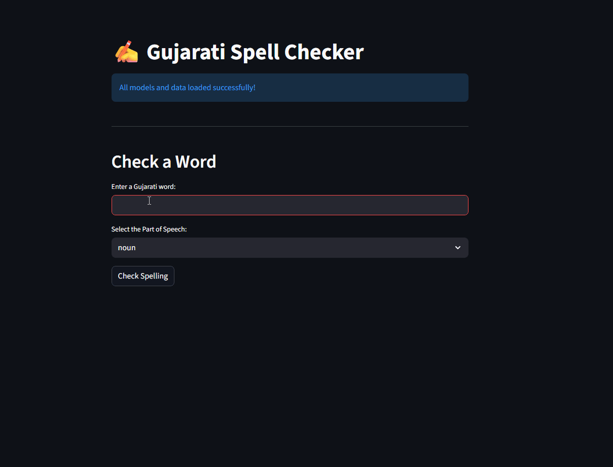

# Intelligent Gujarati Spell Checker

This project is a sophisticated, context-aware spell checker for the Gujarati language. Unlike traditional spell checkers that only use dictionary lookups, this application leverages deep learning models to provide grammatically intelligent suggestions. The entire system is wrapped in a user-friendly web application built with Streamlit.

*(**Action Item:** Create a short GIF of your app working and name it `demo.gif` to replace this placeholder. Tools like [ScreenToGif](https://www.screentogif.com/) or [LiceCap](https://www.cockos.com/licecap/) are great for this.)*

## ✨ Features

- **Smart Lexicon:** The dictionary was built not only from word lists but also enriched with the root forms of words, identified using a custom-trained Keras segmentation model.
- **Candidate Generation:** Uses the Levenshtein distance algorithm to find potential corrections for misspelled words from the lexicon.
- **Deep Learning-Powered Ranking:** The core of the project. It uses three separate Keras models (for nouns, verbs, and adjectives) to analyze the morphological structure of candidate words. Suggestions are ranked based on their grammatical plausibility, not just edit distance.
- **Interactive Web UI:** A clean and simple user interface built with Streamlit allows for easy, interactive spell checking.
- **Efficient Backend:** Heavy assets like the Keras models and the lexicon are loaded into memory only once using Streamlit's caching, ensuring the app is fast and responsive after the initial startup.

## 🛠️ Tech Stack

- **Backend:** Python
- **Deep Learning:** TensorFlow, Keras
- **Web Framework:** Streamlit
- **Data Handling:** Pandas, NumPy, Scikit-learn
- **Core Algorithm:** Levenshtein Distance, custom-trained morphological analysis models

## 📂 Project Structure

The project is organized into a clean, modular structure for maintainability and deployment.

Gujarati_Spell_Checker_App/
│
├── adjective_model.keras
├── noun_model.keras
├── segmentation_model.keras
├── verb_model.keras
│
├── gujarati_lexicon.pkl
│
├── lexicon_utils.py
├── spell_checker_logic.py
├── requirements.txt
│
└── app.py

## 🚀 Setup and Installation

Follow these steps to run the project on your local machine.

**1. Clone the Repository:**
git clone https://github.com/YOUR_USERNAME/Gujarati_Spell_Checker_App.git
cd Gujarati_Spell_Checker_App

**2. Create and Activate a Conda Environment:**

It is highly recommended to use a virtual environment to manage dependencies.
Create a new environment named 'gujSpec' with Python 3.9
conda create --name gujSpec python=3.9
pip install -r requirements.txt

**Note:** If you encounter issues with Git LFS after cloning, run `git lfs pull` to download the large model files.

## ▶️ How to Run

Once the setup is complete, you can launch the web application.

1.  Make sure you are in the project's root directory (`Gujarati_Spell_Checker_App`) and your conda environment is active.
2.  Run the following command in your terminal:
streamlit run app.py

This will automatically open a new tab in your web browser with the application running.

## 🔬 Methodology

The spell checker operates on a three-phase pipeline:

1.  **Error Detection:** The input word is checked against the `gujarati_lexicon.pkl` file. If it exists, it is considered correct.
2.  **Candidate Generation:** If the word is not found, the `generate_candidates` function iterates through the lexicon and uses the Levenshtein distance to find all words within a small edit distance (e.g., 2 edits).
3.  **Candidate Ranking:** The list of candidates is passed to the `rank_candidates` function, which uses the appropriate pre-trained Keras model to assign a "grammatical plausibility" score to each candidate. The list is then re-sorted based on this score.

## 🔮 Future Work

- **Automatic POS Detection:** Implement a function that automatically predicts the POS of a misspelled word.
- **Full Sentence Checking:** Expand the application to check all words in a sentence.
- **Deployment:** Deploy the app to a cloud service like Streamlit Community Cloud to make it publicly accessible.
